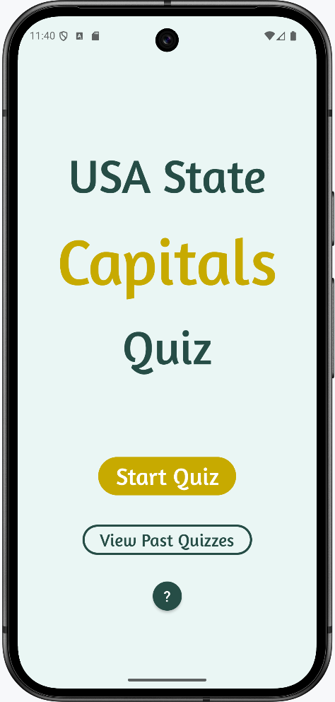
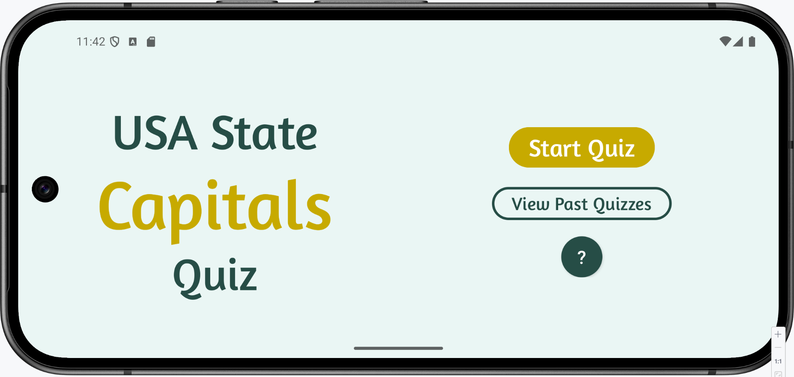
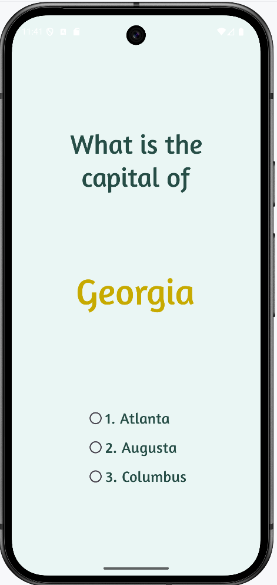
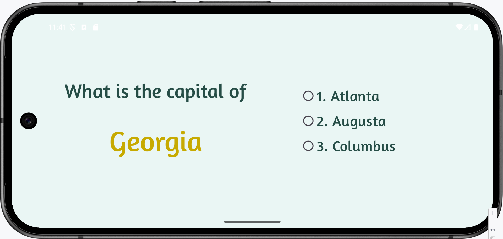
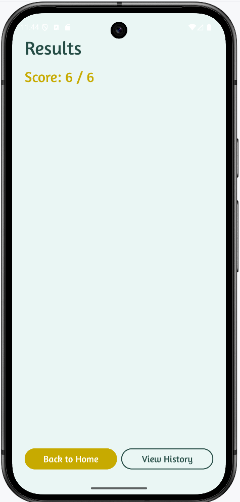
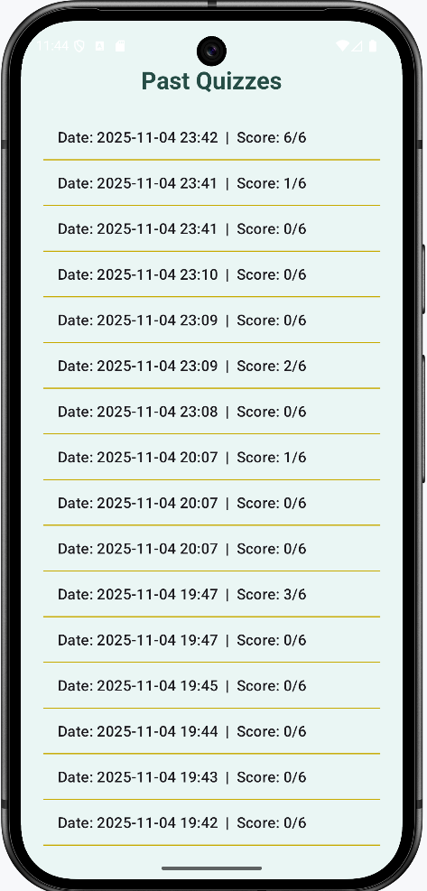
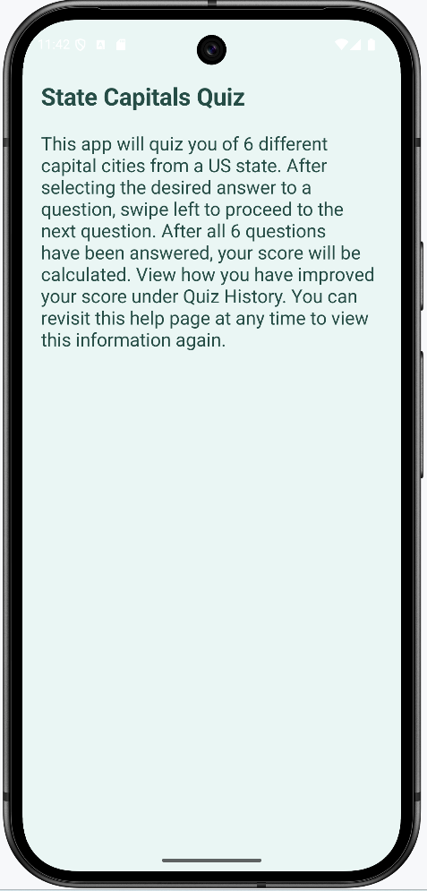

# State Capitals Quiz Android App
Android application that quizzes users on the capitals of the states of the United States. This application utilizes a database to load the states and their information as well as to store the user's quiz history.

## Features
- User identifies the capitals of 6 randomly picked states
- Uses preloaded SQLite database 
- Swiping navigation between questions
- Quiz history with scores & dates
- Fragments to make app visible in both portrait & landscape orientations
- Simple guide on how to navigate the app
- Database queries are performed asynchronously

## Technologies Used
- Language: Java
- UI Layouts: XML
- Database: SQLite
- IDE: Android Studio
- Build System: Gradle
- Testing Environment: Android Emulator

## Screenshots
#### Splash Screen
<a href="images/quiz_splash.png">
  
</a>
<a href="images/quiz_splash_landscape.png">
  
</a>

#### Question Screen
<a href="images/quiz_question.png">
  
</a>
<a href="images/quiz_question_landscape.png">
  
</a>

#### Quiz Results Screen
<a href="images/quiz_results.png">
  
</a>

#### Quiz History Screen
<a href="images/quiz_history.png">
  
</a>

#### Quiz History Screen
<a href="images/quiz_help.png">
  
</a>

## Technologies Used
- Language: Java
- IDE: Android Studio
- Build System: Gradle
- UI Layouts: XML
- Testing Environment: Android Emulator

## Prerequisites
- Android Studio installed (version 2025.1.4 or newer)
- JDK 17+
- Android SDK installed

## Setup
1. Clone this repository
```bash 
git clone https://github.com/nehaau2305/State-Capitals-Quiz.git
```
2. Open the project in Android Studio
3. Allow Android Studio to sync Gradle to ensure all dependencies are installed
4. Add a new device in the Device Manager to run the emulator or connect a physical Android device
5. Run the application using the "Run 'app'" button in the toolbar

## Contribution
- Angela Huang: Set up the databse helper, used database queries to set up quiz & retrieve quiz history, created the quiz fragment, set up the question page gragment & results page fragment, & implemented orientation compatability.
- Nehaa Umapathy: Set up databse in SQLite, designed UI for XML layouts, implemented swiping navigation for question fragments, created fragment host activity, & created the help fragment.
